# Global chat

Player chat is a **global assistant** (right drawer on signed-in pages). One thread survives navigation. A **sticky context** object may include a `deckId` or `cardId` when `getDeck` / `getCard` loads one — routes never open a scoped chat or forget that selection. Each turn also sends **app view** metadata (the open page) so the model can talk about what the player is looking at. The model never runs SQL and never chooses a user id. Tools call existing Nest services; Bedrock is a thin provider behind an interface.

Domain foundations this feature depends on (color identity, Scryfall legalities, required commander) already live in the API and ETL. Do not reintroduce heuristics for commander or legality.

## Architecture

```text
WebSocket (Clerk token) → ChatGateway → orchestrator (tool loop) → domain services
                                              ↓
                                        ChatProvider (Bedrock)
```

- One Nest module [`apps/api/src/chat/`](../apps/api/src/chat/), not a new package.
- One model, five tools: `listDecks`, `getDeck`, `searchCards`, `getCard`, plus server-side `presentRecommendations` for grounding (not UI). Optional compact **stats** ride on `getDeck` (no `getDeckStats` tool).
- Tools call [`DecksService`](../apps/api/src/decks/decks.service.ts) / [`CardsService`](../apps/api/src/cards/cards.service.ts). **No SQL in the AI layer.**
- Provider is an interface; Bedrock is the production implementation. Tools never import the AWS SDK.
- Player UI: header chat toggle (left of theme), AppShell right drawer, WebSocket events, **prose card links** from this conversation’s catalog tool results. Recommendation thumbs are not shown.



## Transport

WebSocket at `/chat/ws` (a second gateway; do **not** multiplex onto `/admin/etl-syncs/ws`). Same envelope convention as admin: `{ event, data }`. Auth: Clerk JWT on connect (`?token=`, same browser `WebSocket` constraint — no custom headers). Player sessions need a logged-in user, **not** `assertAdminUser`.

HTTP is for CRUD only: `GET /chat/conversations` (latest for the user) and `GET /chat/conversations/:id` to reload history after refresh. Sending a turn is a WS `chat.send`, not `POST /chat` SSE.

**Context:** `chat.send` `context` has two layers:

- **Sticky discussion** — `deckId` / `cardId`. Omit to keep the stored id; send `null` to clear; send a uuid to attach (`requireOwnedDeck` / `requireCatalogCard`). These survive navigation and live on `chat_conversation`. Do not infer them from the open route.
- **App view** — `view` metadata for this turn only (`area`, optional viewing deck/card ids, search `q`). Not stored on the conversation. Routes never attach or clear sticky ids.

Follow-ups do **not** reject a different sticky `deckId`.

Send payload (Zod in [`packages/schemas/src/chat.ts`](../packages/schemas/src/chat.ts)):

```ts
type ChatSend = {
  conversationId?: string;
  message: string;
  context: {
    deckId?: string | null;
    cardId?: string | null;
    view?: {
      area: 'home' | 'search' | 'card' | 'deck' | 'new-deck' | 'other';
      deckId?: string;
      cardId?: string;
      q?: string;
    };
  };
};
```

Flow:

```text
WS connect + verifyClerkToken
  → client chat.send
  → if deckId is a uuid: requireOwnedDeck(deckId)
  → if cardId is a uuid: requireCatalogCard(cardId)
  → create or load conversation (user); update sticky deck_id / card_id when set or cleared
  → append user message
  → run orchestrator; push events on the same socket
  → persist assistant message (structured parts)
```

Events pushed as `{ event: 'chat', data }`:

| `data.type`    | Payload                                 |
| -------------- | --------------------------------------- |
| `conversation` | `{ conversationId, deckId, cardId }`    |
| `status`       | `{ code: 'thinking' \| tool name }`     |
| `text`         | `{ delta }`                             |
| `part`         | structured part after server validation |
| `error`        | `{ message }` (user-safe)               |
| `done`         | `{ messageId, parts, deckId, cardId }`  |

The orchestrator emits an event stream the WS gateway wraps. SSE remains a fallback if CloudFront WebSocket proves painful; do not add it until then.

Client helper: [`apps/client/src/lib/chat-ws.ts`](../apps/client/src/lib/chat-ws.ts) (connect, reconnect backoff, queue outbound `chat.send` until open), modeled on admin [`etl-ws.ts`](../apps/admin/src/lib/etl-ws.ts).

## Tools

Shared execution type:

```ts
type ToolContext = {
  clerkUserId: string; // request.auth.userId / WS verifyClerkToken only
  deckId: string | null;
  cardId: string | null;
};
```

`getDeck` stays in the tool list always. Resolve `input.deckId ?? ToolContext.deckId`. A successful load attaches that id as sticky for the rest of the turn and persists it on the conversation. Missing both → `no_deck_context`.

**`listDecks`** — Compact `{ id, name, format, colorIdentity }` for the signed-in user (cap 50). Use this to pick an id for `getDeck` instead of guessing UUIDs.

**`getDeck`** — Auth: `requireOwnedDeck`. Compact deck: id, name, description, format, **color identity** (commander identity on commander format; otherwise union of mainboard), `commander` `{ printingId, cardId, name }` or `null`, card count, lines `{ cardId, name, typeLine, manaValue, colorIdentity, quantity, sideboard }` **without image URLs**, plus `stats` (type counts, mana curve). Cap lines (400) with a truncated flag. Commander is never inferred.

**`searchCards`** — Same structured filters as HTTP `GET /cards` (`q`, `colorIdentity`, `legalIn`, `typeContains`, `maxManaValue`, `excludeCardIds`). Tool max **50** (default 25). When the conversation has a deck, the **tool layer** (not the model) always injects `legalIn` from deck format, `excludeCardIds` from the current list, and `colorIdentity` from the commander when `format === 'commander'`. Without a deck, the model may pass `legalIn` / `colorIdentity` if the player named a format or colors.

**`getCard`** — `{ cardId }`. Reuse `getById`; include legalities and color identity; omit bulky printing lists (the client hydrates by id). A successful load persists sticky `card_id` the same way `getDeck` persists `deck_id`.

**`presentRecommendations`** — `{ cardIds, notes? }`. Cap 25 ids. If the player asked for a count, present that many (capped). Otherwise present the strong fits from this turn’s catalog results — no default of 3. Ids must be in **this turn’s** `searchCards` / `getCard` results. Drop unknown ids; log `chat.ungrounded_id`. This tool **grounds** the turn for the model and evals; it does **not** attach card images. The model must not emit HTML or invent ids. Prose may use `[Name](/cards/<id>)` the first time a card appears, or when citing a ruling or other specific detail; later casual mentions stay plain text. Before persist, the server allowlists those hrefs against this **conversation’s** `searchCards` / `getCard` / `getDeck` tool results (reconstructed from persisted tool messages, plus this turn) and does **not** auto-link remaining names. `getDeck` ids are **not** added to the `presentRecommendations` allowlist.

**Errors:** tools return `{ ok: false, code, message }` JSON, not thrown provider exceptions. HTTP 404 from `requireOwnedDeck` becomes `code: 'not_found'`.

**Loop limits:** max 10 model rounds, max 16 tool calls, 45s budget per round. On limit: WS `error` with a safe message.

MVP tools are **read-only**. Future writes (add card to deck) need confirmation UX, not silent tool execution.

### Recommendation workflow

For "What would be a good add to this deck?" when a list is attached (or after `listDecks` + `getDeck`):

```text
getDeck (sticky or explicit owned id)
  → format, commander, colorIdentity, in-deck cardIds, type/curve stats
searchCards({
  colorIdentity / legalIn / excludeCardIds injected by the tool layer
  q or typeContains from the user
  limit: 25
})
  → presentRecommendations (player’s count, or the strong fits — not a default of 3)
  → text grounded in returned oracle fields
```

Without a sticky deck, skip `getDeck` unless the player named a list; do not inject format/identity/excludes.

Do **not** send the catalog. Do **not** require pgvector. Keyword `q` is still weak for "interaction"; identity + legality + exclude + a 25-hit search is the MVP bet.

## Structured parts

```ts
type ChatPart =
  | { type: 'text'; text: string }
  | { type: 'card'; cardId: string }
  | { type: 'card-list'; cardIds: string[] };
```

Stream prose as `text` deltas. Do **not** emit `part` for recommendation thumbs. `card` / `card-list` remain in the schema so stored history still parses; the client ignores them. Before persist, rewrite prose to keep allowlisted `/cards/<uuid>` markdown; do not auto-link remaining names. The system appendix lists a capped name+id slice (`CHAT_GROUNDED_CARD_PROMPT_CAP`, newest last) so follow-ups can cite earlier retrievals after tool payloads drop from the model window. The client renders those hrefs as in-app links. Persist text `parts` only.

System prompt (versioned in [`prompts.ts`](../apps/api/src/chat/prompts.ts), not secret):

- Sticky deck/card is discussion context. App view is the open page; it does not attach or clear sticky ids.
- If they ask about what is on screen, use viewingDeckId / viewingCardId with getDeck / getCard.
- Never name a card unless it is in this conversation’s tool results. If you need another card, call searchCards or getCard first. Do not use training-data names.
- Do not claim a card is in a deck unless `getDeck` listed it.
- presentRecommendations commits this-turn search/getCard ids for prose; the UI does not attach images.
- Link a retrieved card as `[Name](/cards/<id>)` only the first time it appears, or when citing a ruling or specific detail; later mentions stay plain text. Do not invent ids.
- If tools fail, say so; do not fill from model memory.
- Application data wins over model knowledge.

## Persistence

Tables in **`app`** (same product surface as decks):

- `chat_conversation`: id, user_id, deck_id / card_id (nullable sticky last-picked deck and catalog card, both `ON DELETE SET NULL`), created_at, updated_at. `view` is not a column.
- `chat_message`: id, conversation_id, role (`user` | `assistant` | `tool`), parts jsonb, tool_name / tool_call_id nullable, created_at

Persist user + assistant messages every turn. Persist **tool messages** (name, args, compact result) for debugging and to rebuild the conversation’s linkable catalog cache. They are **not** all replayed unbounded into the next model call (`selectHistoryMessages` drops tools). `ChatService.loadLinkableCards` reads those rows and feeds linking plus a capped grounded name list in the system prompt.

MVP history window: last **12** user/assistant messages + **this turn's** tool results. No summarization.

Provider memory is not a source of truth.

## Provider

```ts
type ChatProvider = {
  stream(input: {
    system: string;
    messages: ProviderMessage[];
    tools: ProviderToolDef[];
  }): AsyncIterable<ProviderEvent>;
};
```

Events: `text-delta`, `tool-call`, `tool-call-end`, `usage`, `stop`.

Production: AWS SDK v3 `BedrockRuntimeClient` `ConverseStream` in `bedrock.provider.ts` as the **develop EC2 instance role**. Local Compose uses a dedicated IAM user (`respark-local-api`) from `infra/envs/local` — not the `terraform` operator user. Keys: `task api:local-aws:write` → `apps/api/.env.local`. `CHAT_PROVIDER=mock` is opt-in. CI evals use `ScriptedChatProvider`, not the live mock.

**MVP model: Haiku 4.5** via the US inference profile (`us.anthropic.claude-haiku-4-5-20251001-v1:0`). On-demand foundation-model ids are rejected for this model. Quality bar is "ids from our catalog that pass identity + legality," which is mostly tools + gates. Model id is SSM / `BEDROCK_MODEL_ID` so we can switch to Sonnet without a code rewrite. Record the resolved id on every `chat.turn`.

## Security

- LLM never executes SQL or chooses `clerkUserId`.
- `ToolContext.clerkUserId` only from WS `verifyClerkToken` (same principal as HTTP `ClerkAuthGuard`).
- Deck access only via `requireOwnedDeck`.
- Tool args Zod-validated; extra keys stripped.
- Tool payloads compact; **no secrets**, no SSM, no raw env in prompts.
- Model output untrusted; card ids allowlisted against retrieval.
- Pino already redacts `authorization`; do not log JWTs or full prompt dumps containing PII at `info`.

## Observability

One structured Pino object per turn: `event: 'chat.turn'` with `conversationId`, `deckId` (null when unbound), `model`, `rounds`, `stopReason` (`completed` / `max_tool_calls` / `max_rounds` / `timeout` / `provider_error`), `pendingTools` (names the model still wanted), `tools[]` (name, round, latencyMs, ok, `code` when failed), `inputTokens`, `outputTokens`, `estimatedUsd`, `latencyMs`, `error`. Failed tools and early stops also emit `chat.tool` / `chat.turn_stopped` at **warn**. Do not log full tool payloads or message text at `info` (search `q` is fine; use `debug` for input keys). CloudWatch already ingests API stdout. Skip OpenTelemetry / Langfuse until a second model or production volume needs them.

## Infra (chat identities)

- **Local** — IAM user `respark-local-api` (`infra/envs/local`). Keys in `apps/api/.env.local`, not Terraform state. Recreating Compose does not change this IAM policy.
- **Develop** — API EC2 instance role (`respark-develop-api-ec2`) with the same Bedrock invoke policy. IMDS hop limit **2** so the container can use the instance profile.
- Invoke policy covers foundation-model and inference-profile ARNs in every US CRIS destination Region (`us-east-1`, `us-east-2`, `us-west-2`), including model ids that end in `:0`. Haiku 4.5 also needs Marketplace `Subscribe` / `ViewSubscriptions` so Bedrock can complete the third-party model agreement.
- **Production** — later; same pattern as develop.
- CloudFront origin read/keepalive timeouts raised; gateway sends WebSocket pings so idle connections survive.
- SSM `…/api/bedrock-model-id` (not a secret) injected as `BEDROCK_MODEL_ID` on develop.

## Local workflow

```text
task docker:up                 # Postgres + API
task infra:apply ENV=local     # IAM user respark-local-api (once)
task api:local-aws:write       # keys → apps/api/.env.local (gitignored)
docker compose up -d api --force-recreate
header chat toggle (left of theme)
watch Pino: chat.turn          # model is the Bedrock id; identity is respark-local-api
```

## Evals

Vitest in `apps/api`. CI runs fixture evals **without Bedrock**:

1. Unit: Zod schemas, compact mappers, allowlist, history window.
2. Tool tests: mocked services — ownership 404, search limit, injected filters.
3. Orchestrator: scripted provider — "good add" must call `getDeck` then `searchCards`.
4. Offline fixtures under `apps/api/src/chat/evals/` — score tools and allowlisted `presentRecommendations` ids against that turn’s `searchCards` / `getCard` hits, not thumbs.
5. Live Bedrock eval: optional, gated by env, not CI.

## Out of MVP

Collection, prices, tournaments, rules RAG, pgvector / semantic search, multi-agent, Scryfall search syntax, autonomous deck edits, partner commanders.

New capability later = domain service → Zod tool → register → eval. Same orchestrator.
