# Domain model

What the major objects are, why they exist, and how they relate. Column-level source of truth is Drizzle under [`apps/api/src/db/schema/`](../apps/api/src/db/schema/). Pipeline behavior lives in [`docs/etl/`](etl/overview.md).

If you have a diagrams.net architecture file, drop `architecture.drawio` (and an exported SVG) into `docs/diagrams/` and we can embed it here. The Mermaid system diagram below is the in-repo version.

## System

| Piece        | Role                                                                                      |
| ------------ | ----------------------------------------------------------------------------------------- |
| **Client**   | Player app: decks, card search, chat, Clerk-signed requests to the API                    |
| **Admin**    | Ops dashboard: start ETL syncs, watch jobs over WebSocket                                 |
| **API**      | Nest: auth, decks, catalog reads, Clerk webhooks, embeds the etl lib, chat tools          |
| **etl lib**  | In-process ingest (also a CLI). Writes `raw` / `catalog` / `ops`. Never creates app decks |
| **Clerk**    | Authentication and profile source of truth. Local `app.users` is a cache                  |
| **Postgres** | One database, four live schemas (`raw`, `catalog`, `ops`, `app`). `market` is reserved    |

Deployed develop hosts the SPAs and API behind CloudFront; RDS is private to the API instance. See [`docs/ci-cd.md`](ci-cd.md) and [`infra/envs/develop`](../infra/envs/develop/README.md).

## Postgres schemas

| Schema    | Owns                                             | Writers                           |
| --------- | ------------------------------------------------ | --------------------------------- |
| `app`     | Player identity, decks, and chat threads         | API request path + Clerk webhooks |
| `catalog` | Canonical cards, sets, printings                 | ETL catalog (+ identifiers job)   |
| `ops`     | Sync/job runs, errors, identifier reconciliation | ETL                               |
| `raw`     | Latest provider JSON snapshots (optional)        | ETL                               |
| `market`  | Future pricing observations                      | —                                 |

Internal primary keys are UUIDs (except a few `bigserial` ops tables). Provider ids are unique constraints or identifier rows, not PKs.

## Player objects (`app`)

### User (`app.users`)

Local row for a Clerk account. Clerk owns sign-in; this table owns the UUID every other app table references so decks never store a Clerk id.

- **Profile fields** (`email`, names, `image_url`) are a cache filled by `user.created` / `user.updated` webhooks. Do not write them from product code.
- **`clerk_updated_at`** ignores out-of-order webhook deliveries.
- **`deleted_at`** is a soft delete. Decks stay on disk. Authenticated API calls resolve the user and return **403** while this is set; restore is a deliberate later operation.
- First authenticated request can **insert** the row if the webhook has not landed yet (`resolveLocalId`).

### Deck (`app.decks`)

A player's named list. `format` is `standard`, `commander`, or `modern`. Commander-format decks always have `commander_printing_id` (a `catalog.printing`); other formats leave it null. The commander must be legal in Commander and have `leadershipSkills.commander` from MTGJSON. Deck color identity is the commander's identity for commander, otherwise the union of mainboard cards. Mainboard adds must stay inside that identity on commander decks. Deleting a deck cascades to its lines. Deleting a user (hard) would cascade decks; soft-delete does not.

### Deck line (`app.deck_card`)

One stack in a deck: a **printing** + foil + main/sideboard + quantity. Unique on `(deck_id, printing_id, foil, sideboard)`. Adding a card by oracle id picks a default printing (image + recency). Changing printing/foil/board merges into an existing line when the key collides. Quantity `0` deletes the line. Etched and foil-only printings are always foil (the line flag cannot be turned off).

The line points at `catalog.printing`, not `catalog.card`, so the player can choose set, collector number, and art.

### Chat conversation (`app.chat_conversation`)

One thread per user, not per page. Optional sticky **`deck_id`** and **`card_id`** are last-picked discussion context (`getDeck` / `getCard` or an explicit send), not conversation identity. Follow-ups keep those values unless the client sets or clears them. Deleting a deck or catalog card sets the matching column to null; the thread remains. The open page is sent per turn as view metadata and is not stored on this row.

### Recommendation goodstuff (`app.recommendation_goodstuff`)

Admin-maintained policy list of generically strong cards (multi-tag: interaction, ramp, counterspell, etc.). Soft flag on search / getCard and a short chat prompt appendix. Not a catalog fact and not a search ban. Tags live on `app.recommendation_goodstuff_tag`. Starter rows are inserted by migration; list/add/remove is on `/admin/recommendation-goodstuffs`.

### Chat message (`app.chat_message`)

A turn in a conversation: `user` / `assistant` / `tool`, with structured `parts` jsonb (text, card ids). Tool rows (name, args, compact result) are stored for debugging and are not replayed unbounded into the next model call. See [`docs/ai-chat.md`](ai-chat.md).

## Catalog objects (`catalog`)

Scryfall is the source of truth for identity, printings, sets, images, and format legalities. The identifiers job attaches extra IDs to **existing** printings and copies MTGJSON `leadershipSkills` onto `catalog.card.leadership_skills`, plus EDHREC salt.

### Card (`catalog.card`)

The conceptual / oracle card (`oracle_id` from Scryfall). Shared rules text, colors, type line, format `legalities` (Scryfall map), and `leadership_skills` (MTGJSON `leadershipSkills`, including `commander` / `brawl` / `oathbreaker`). Global Commander popularity is `edhrec_rank` (Scryfall) and `edhrec_saltiness` (MTGJSON); `is_game_changer` comes from Scryfall, with MTGJSON as fallback. Search and autocomplete query this table; the deck builder then picks a printing. `GET /cards` accepts `sort=name` (default) or `sort=edhrecRank`. Per-commander inclusion is not stored ([commander-stats.md](commander-stats.md)). Adds and imports reject cards that are not `legal` in the deck’s format once legalities have been synced. Commander search and commander assignment require `leadershipSkills.commander`. Tokens, emblems, art series, minigames, planes, schemes, vanguards, and other Scryfall extras are not imported (`layout` / `set_type`, not legalities). The identifiers job skips the same extras.

### Set (`catalog.set`)

A published set (`code` unique, plus optional Scryfall set id). Printings belong to a set with `ON DELETE RESTRICT` so a set is not dropped out from under cards.

### Printing (`catalog.printing`)

One physical or digital printing of a card in a set (`scryfall_id` unique). Collector number, language, rarity, artist, image URLs, and `finishes` (`nonfoil`, `foil`, `etched`, …). A deck line may be foil when `foil` or `etched` is in that list (empty means not synced yet). Etched and foil-only printings always show the foil overlay; dual `nonfoil`+`foil` printings stay optional. This is what a deck line stores.

### Card face (`catalog.card_face`)

Per-face text, power/toughness, and images for multi-face layouts (DFCs, split, etc.). Unique `(printing_id, face_index)`. Deck/search image fallbacks use face `0` when the printing has no card-level image.

### Printing identifier (`catalog.printing_identifier`)

External ids on a printing: `provider` + `external_id` (MTGJSON, TCGPlayer, Cardmarket, MTGO, Multiverse, …). Composite primary key. Enrichment **never** inserts a `printing` row to make these fit.

## Pipeline objects (`ops`)

Nomenclature (sync / stage / job) is in [`docs/etl/overview.md`](etl/overview.md).

### ETL sync (`ops.etl_sync`)

One user- or CLI-triggered run. Records which stages ran (`include_catalog`, `include_enrichment`, `enrichment_jobs`) and a rolled-up `status`: `running`, `success`, `partial_success`, `failed`.

### Job run (`ops.etl_job_run`)

One job inside a sync (today: `catalog`/`catalog`, `enrichment`/`identifiers`). Counters, source URL/version, duration. Admin list/detail and the live WebSocket are keyed off these rows.

### Sync log (`ops.etl_sync_log`)

Notable messages for the admin log panel after a run (`job.log`, job start/complete, sync complete). Progress ticks are not stored.

### Ingestion error (`ops.ingestion_error`)

Per-record failure so one bad card does not abort the job. `stage` here is the **processing step** (validate / transform / reconcile), not the sync stage. `run_id` is the job run; there is no formal FK in Drizzle today.

### Reconciliation (`ops.ingestion_reconciliation`)

One summary row per identifiers job: matched / unmatched / ambiguous counts and flags (`dry_run`, `demo_mismatches`).

### Unmatched (`ops.ingestion_unmatched`)

Sampled MTGJSON rows that did not attach to a catalog printing. Review surface in admin; they do not become catalog entities.

## Raw snapshots (`raw`)

Optional latest-payload store (toggle `--no-store-raw` / `ETL_STORE_RAW`). Used to skip no-op rewrites via `payload_hash` and to debug provider JSON. Can dominate disk if both Scryfall and MTGJSON are stored.

| Table               | Key            | Purpose                             |
| ------------------- | -------------- | ----------------------------------- |
| `raw.scryfall_card` | `scryfall_id`  | Full Scryfall card object           |
| `raw.mtgjson_card`  | `mtgjson_uuid` | AllIdentifiers entry for enrichment |

These tables do not FK into `catalog`. Join by Scryfall id when needed.

## Related

- [ETL data model](etl/data-model.md) — shorter schema table reference
- [ETL operations](etl/operations.md)
- [ETL streaming](etl/streaming.md)
- Drizzle schema: [`apps/api/src/db/schema/`](../apps/api/src/db/schema/)
