# ETL overview

Respark ingests Magic: The Gathering card data into PostgreSQL so the app never depends on live provider APIs for catalog identity.

## Nomenclature

| Term      | Meaning                               | Storage                   |
| --------- | ------------------------------------- | ------------------------- |
| **Sync**  | One user-triggered pipeline execution | `ops.etl_sync`            |
| **Stage** | Ordered phase inside a sync           | `catalog` \| `enrichment` |
| **Job**   | Concrete work unit inside a stage     | see below                 |

```text
ETL Sync
├── Stage: catalog
│   └── Job: catalog          → Scryfall catalog (source of truth)
└── Stage: enrichment
    └── Job: identifiers      → Printing identifiers (MTGJSON)
    └── (future) pricing, rulings, …
```

A sync may run catalog only, enrichment only, or both. Enrichment-only is allowed but assumes an existing catalog; the admin UI warns when Catalog is unchecked.

## Sources of truth

| Concern                                                                                               | Owner                         |
| ----------------------------------------------------------------------------------------------------- | ----------------------------- |
| Oracle identity, printings, sets, images, legality fields                                             | **Scryfall** (catalog job)    |
| Cross-provider IDs on existing printings (`mtgjson`, `tcgplayer`, `cardmarket`, `mtgo`, `multiverse`) | **MTGJSON** (identifiers job) |

Enrichment **never creates** `catalog.printing` rows. Unmatched MTGJSON cards are recorded for review; they do not become catalog entities.

The catalog job skips Scryfall objects whose `type_line` has a bare `Card` face (art cards, theme cards, token/emblem backs such as `Emblem // Card`). They are not written to `catalog` or `raw`. The identifiers job skips the same extras (MTGJSON `type` is usually just `Card`) so they do not show up as unmatched.

## Architecture



| Surface                    | Role                                                               |
| -------------------------- | ------------------------------------------------------------------ |
| **etl lib** (`runEtlSync`) | Business logic + typed progress events                             |
| **API**                    | Calls the lib in-process; fans events out over WebSocket           |
| **CLI**                    | TTY / report adapter for break-glass maintenance (`task etl -- …`) |

Postgres `NOTIFY` on `ops.etl_sync` also refreshes the admin list when syncs are started from the CLI.

## Package layout

```text
apps/etl/src/
  index.ts                 # public exports
  cli.ts                   # commander TTY entrypoint
  lib/run-sync.ts          # orchestration
  core/stream-events.ts    # SyncEvent types
  sources/scryfall/        # catalog job
  sources/mtgjson/         # identifiers job
  repositories/            # SQL helpers
  commands/report.ts       # size report
```

The admin API imports this package from `apps/etl/dist` (see [operations](operations.md)). `task etl --` uses `tsx` on `src/` directly.

DDL and Drizzle schemas live in `apps/api` (`task db:migrate`).

## Related docs

- [Domain model (objects + ERDs)](../domain.md)
- [Data model](data-model.md)
- [Operations](operations.md)
- [Streaming](streaming.md)
